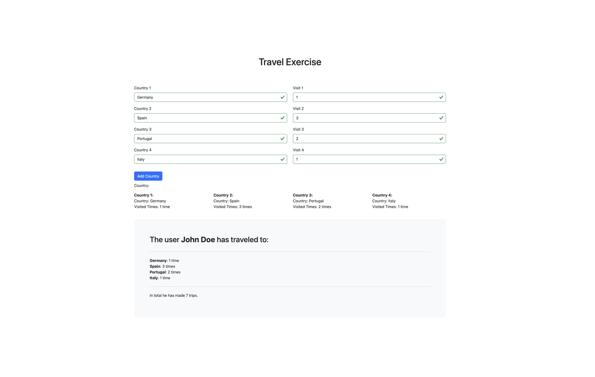

# Form Validation with TypeScript

## Introduction

This project is a form validation implementation using TypeScript. It showcases how to create robust and user-friendly forms by leveraging the power of TypeScript in conjunction with HTML and CSS.

## Description

The main focus of this project is to demonstrate the use of TypeScript for adding type safety and structure to the process of validating user inputs in web forms. The project includes various form fields with different validation criteria, such as:

- Text fields that accept only alphabetical characters.
- Number fields with specific numeric constraints.
- Custom validation logic for specific input patterns.

## Setup and Installation

To get this project up and running on your local machine, follow these steps:

1. Clone this repository to your local machine.
2. Navigate to the project directory.
3. Install the necessary dependencies:

`npm i`
`tsc --w`

## Features

- Text fields that accept only alphabetical characters.
- Number fields with specific numeric constraints.
- Custom validation logic for specific input patterns.

## Usage

After setting up the project, you can open the HTML file in a browser to interact with the form and test the validation logic. The form will provide immediate feedback based on the input values.

## Technologies Used

This project utilizes the following technologies:

- **HTML**: For structuring the web form.
- **CSS**: For styling the form elements.
- **TypeScript**: For implementing form validation logic with type safety.

## Badges/Shields

Dev Skills

## About Me

I'm an aspiring frontend developer exploring the world of web development through Angular. This project is a testament to my commitment to learning and applying modern web development practices.

## Contact

For any inquiries or feedback, feel free to reach out to me via email: [codenaud@gmail.com](mailto:codenaud@gmail.com)

Happy coding with Angular! 🚀
